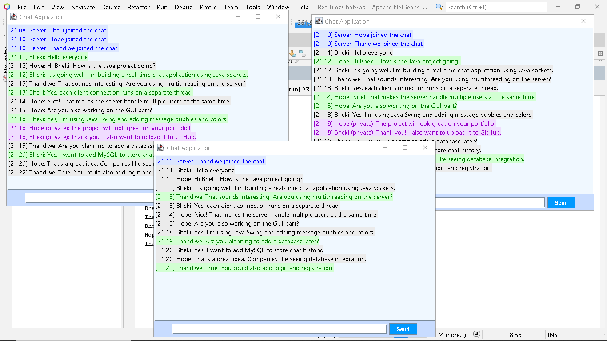

# 🌐 Real-Time Java Chat Application

## Overview
This project is a **Java-based real-time chat application** that allows multiple users to communicate simultaneously.  
It demonstrates **network programming, multithreading, and GUI design** using Java Swing.  

The application replicates modern chat features similar to messaging platforms, making it a **powerful portfolio piece**.

---

## ✨ Key Features
- **Multi-Client Chat:** Multiple users can connect and chat simultaneously.  
- **Private Messaging:** Users can send direct messages to specific participants using `@username`.  
- **Message Bubbles:** Each message appears in a bubble style for readability.  
- **Colored GUI:** Different colors for users and messages enhance user experience.  
- **Timestamped Messages:** Shows exact time of each message.  
- **User Join/Leave Notifications:** Real-time alerts when a user connects or disconnects.  
- **Simple, Interactive GUI:** Built with Java Swing with a responsive, colorful interface.

---

## 🛠 Technologies Used
- **Language:** Java  
- **Networking:** Java Sockets (TCP/IP)  
- **Concurrency:** Multithreading for multiple clients  
- **GUI:** Java Swing (JFrame, JTextArea, JTextField, JScrollPane)  
- **Utilities:** BufferedReader, PrintWriter for streams  
- **Version Control:** Git & GitHub  

---

## 📝 How It Works
1. **Server** listens on port 5000 and accepts multiple clients.  
2. **Clients** connect and provide a username.  
3. Messages are **broadcasted** or sent privately with `@username`.  
4. GUI updates in real-time with **colored messages and timestamps**.  
5. Users are notified whenever someone **joins or leaves**.

---

## 🎯 Learning Outcomes
- Implemented **real-time network communication** in Java.  
- Practiced **multithreading** to handle concurrent connections.  
- Designed a **user-friendly and visually appealing GUI**.  
- Developed **private messaging logic** for enhanced chat functionality.  
- Applied **software design principles** for maintainable, scalable code.

---

## 📸 Screenshots

---

## 🚀 How to Run
1. Open the project in **NetBeans**.  
2. Run `ChatServer.java` first to start the server.  
3. Run one or more instances of `ChatClient.java` to connect and start chatting.  
4. Type messages in the text field; use `@username` for private messages.

